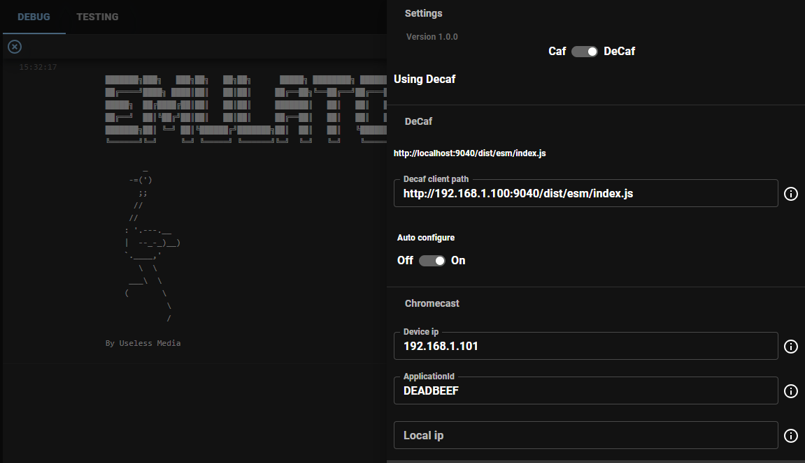

# How to build a DeCaf Client

## Introduction
In this guide we are going to build a client for the [DeCaf framework](https://decaf.cc) in TypeScript using the
[DeCaf Client Sdk](https://github.com/useless-media-public/useless-decaf-client-sdk). When the DeCaf framework loads a
client it expects to find a `constructor` exported as either `DeCafClient` or `Client`. We will use
[Rollup](https://rollupjs.org/) and [esbuild](https://esbuild.github.io/) to produce a CJS and ESM compatible output.

## Prerequisites
This guide assumes you have a general idea of what the DeCaf framework is (if not, check out the
[website](https://decaf.cc)).

## Environment setup
You can set your environment up in any way you would like, with whatever tooling you are comfortable with so long as it
produces a browser-compatible javascript file which exports a `constructor` as either `DeCafClient` or `Client`. Our
tooling of choice is Rollup and esbuild and to make things easy we have put together a
[scaffold](https://github.com/useless-media/useless-decaf-client-scaffold) that will just run, making it really fast to
get started with the actually interesting parts. You can just clone, fork or download a zip of this scaffold and you're
in business.

```
git clone https://github.com/useless-media/useless-decaf-client-scaffold my-decaf-client
cd my-decaf-client
npm install
npm run start:dev
```

This will give you a folder structure that looks like:
```
├── src/
│   ├── css/
│   │   └── index.css
│   ├── ts/
│   │   ├── index.ts
│   │   └── ScaffoldDeCafClient.ts   <-- Note: This should be renamed to something of your choosing 
├── .gitignore        
├── .npmrc        
├── package.json        
├── package-lock.json        
├── rollup.config.js        
└── tsconfig.json        
```

The configuration of this project uses `src/ts/index.ts` as entry point and expects the rest of the code to be placed
under `src/ts/`. If you would like a different structure, feel free to change this in `rollup.config.js` and
`tsconfig`.json.

As the note above suggests we'll start by renaming the `ScaffoldDeCafClient` to `MyDeCafClient`. If your IDE doesn't do
it for you, remember to also update the export in `index.ts`, it should now look like:

```
export {
  MyDeCafClient as DeCafClient
} from './MyDeCafClient';
```

If you haven't already, it is now time to start the build:
```
npm run start:dev
```

Now our (empty) client is available at `http://localhost:9040/dist/esm/index.js`. This is enough to actually run the
client locally using the [Useless Emu-Later](ToDo:LinkHere) but in order to also be able to run in on a real Chromecast
device we recommend to **always** use your local network IP instead of localhost, for example:
`http://192.168.1.100:9040/dist/esm/index.js`.

Of  course, if we were to run this now nothing would really happen as the client is empty so lets get on to interesting
parts.

## Building a simple (mp4) decaf client
The `ScaffoldDeCafClient` came with some boilerplate code in the constructor to make sure there is a video element on
the page. You don't need to keep that around in the real world but for this tutorial we're going to use it.

We are going to add a few listeners to the video element to update the `PlaybackSessionState` of the DeCaf framework.
This will ensure that the correct playback status gets communicated to all Chromecast senders.
```
private registerListeners(): void {
  this.video.addEventListener('durationchange', () => {
    this.state.setDuration(this.video.duration);
  });
  this.video.addEventListener('ended', () => {
    this.state.reset();
  });
  this.video.addEventListener('loadeddata', () => {
    this.state.setPlaybackState(PlaybackStates.Loaded);
  });
  this.video.addEventListener('pause', () => {
    this.state.setPlaybackState(PlaybackStates.Paused);
  });
  this.video.addEventListener('playing', () => {
    this.state.setPlaybackState(PlaybackStates.Playing);
  });
  this.video.addEventListener('timeupdate', () => {
    this.state.setTime(this.video.currentTime);
  });
  this.video.addEventListener('volumechange', () => {
    this.state.setVolume(this.video.volume, this.video.muted);
  });
}
```

And call it at the end of the constructor.
```
...
    container.appendChild(this.video);
  }

  this.registerListeners();
}
```

And finally, we're going to implement the `handleLoad` function which will be called by the DeCaf framework whenever
a Chromecast sender wants to play something.
```
public async handleLoad(message: LoadMessage): Promise<void> {
  if (message.media?.contentUrl) {
    this.state.setPlaybackState(PlaybackStates.Loading);
    this.video.src = message.media.contentUrl;
  }
}
```

## Running the decaf client
Now are going to run this client using the [Useless Emu-Later](ToDo:LinkHere). We'll start by configuring the Emu-Later:
1. Ensure that DeCaf is enabled.
2. As "Decaf client path", put: `http://[YourLocalNetworkIp]:9040/dist/esm/index.js`.
3. Enable "Auto configure". If this is disabled you will need to manually issue a configure command every time the
emulator is launched.
4. "Device ip" and "ApplicationId" are only needed to run this on a real Chromecast device, so we will skip these for now. 

It should look something like this:



After configuring you should be able to launch the emulator, cast an asset from the `Asset View` and see it playing in
the emulator. Be sure to cast an MP4 asset as that is all we have implemented support for at the moment. If you are
unsure of how to construct the asset or don't have any good content lying around you can always import one or more of
the available [Asset bundles](ToDo:LinkHere).

## Conclusion
And that's how easy it is to build and test a DeCaf Chromecast receiver application where you are in full control of
the visual experience, without ever leaving the comfort of your own computer.

The full code for this tutorial can also be found
[here](https://github.com/useless-media/useless-decaf-client-guide-part-1).

## Next up
Next we see how we can build something a little more capable, using the popular
[hls.js](https://github.com/video-dev/hls.js) player in [DeCaf Client - Part 2](guides/DeCafClient.Part2.md).